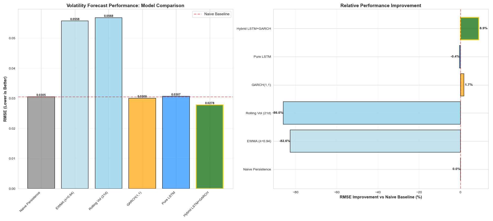
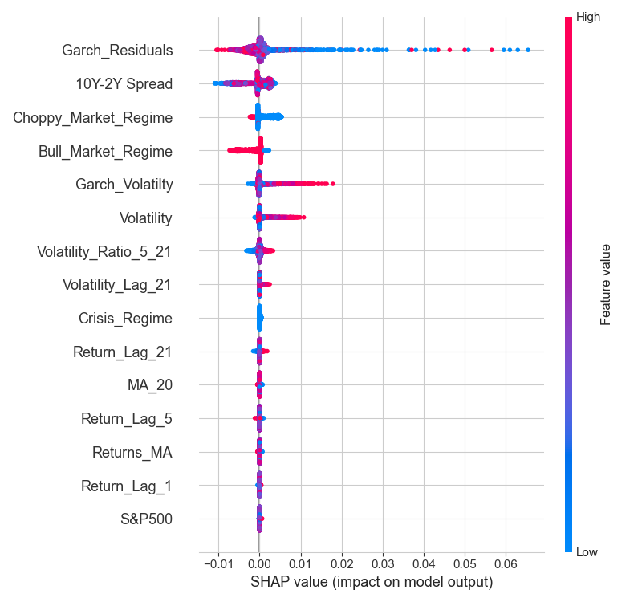

# Volatility-Forecasting-Using-Regime-Aware-LSTM-and-GARCH-Model

This project explores short-term volatility forecasting for the S&P 500 using both traditional econometric methods and modern deep learning models. It emphasizes the role of volatility clustering, regime switching, and the integration of structured financial indicators for improved predictive performance.

---

## 📘 Project Overview

- **Objective**: Predict 1–5 day ahead volatility using statistical models (GARCH) and deep learning (LSTM), with a focus on improving forecast accuracy during different market regimes.
- **Techniques**: 
  - Volatility clustering analysis
  - Stationarity testing
  - Regime detection (Bull, Choppy, Crisis)
  - GARCH modeling
  - LSTM with engineered volatility and regime features
  - Model explainability using SHAP values
  - Visual and quantitative model comparisons

---

## 📊 Sample Outputs

### 📉 5-Day Volatility Forecast


### 📉 Benchmark Comparison


### 🧠 SHAP Feature Evaluation


---

## ⚙️ How to Run

1. Clone this repository and navigate to the folder:

```bash
git clone https://github.com/yourusername/Volatility-Forecasting-Using-Regime-Aware-LSTM-and-GARCH-Model.git
cd Volatility-Forecasting-Using-Regime-Aware-LSTM-and-GARCH-Model
```

2. Install the required packages:

```bash
pip install -r requirements.txt
```

3. Open the notebook:

```bash
jupyter notebook "Volatility Forecasting.ipynb"
```

---

## 📈 Model Comparison

| Model         | Highlights                                               |
|---------------|----------------------------------------------------------|
| **GARCH**     | Baseline with volatility clustering                      |
| **LSTM**      | Learns temporal dependencies & nonlinear volatility patterns |
| **Hybrid**    | LSTM with engineered GARCH residuals and volatility terms |

---

## 🚀 Extensions

- Add real-time VIX or macroeconomic news sentiment
- Incorporate Transformer-based models (e.g., Temporal Fusion Transformer)
- Develop an ensemble model combining GARCH and LSTM predictions
- Deploy with a simple dashboard for live monitoring

---

## 📜 License

_No license currently applied. Contact the author for reuse._

